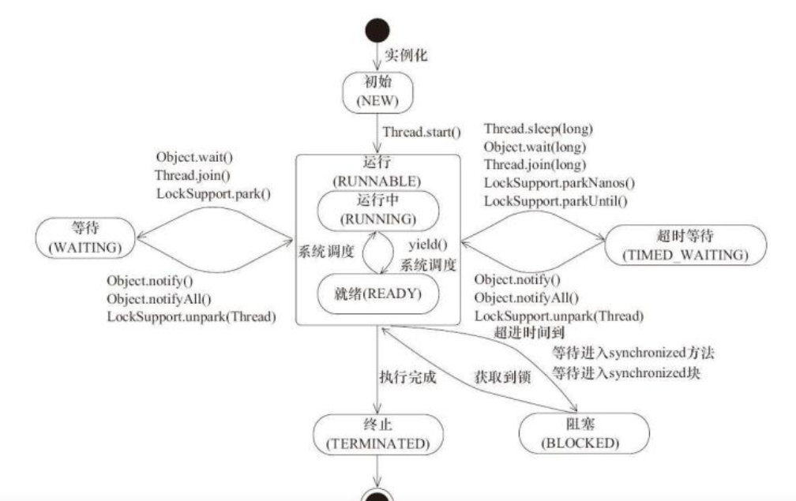

### 线程的状态
初始状态(new) 新建一个线程对象，但是没有执行start方法
运行状态(Runnable) java 线程将就绪状态以及运行状态统一成为运行状态，就绪状态的线程必须获取到
CPU时间片才能进行运行状态
阻塞状态(Blocked) 表示线程阻塞于锁 比如Synchonized
等待状态(waitting) 表示线程处于等待状态，不会获取CPU时间片
超时等待(Timed_watiting) 表示超过一定时间自动进入线程就绪状态，等待状态线程是不是会获取到CPU时间片
中止状态(terminated) 表示线程运行完成，线程消亡
***

***

